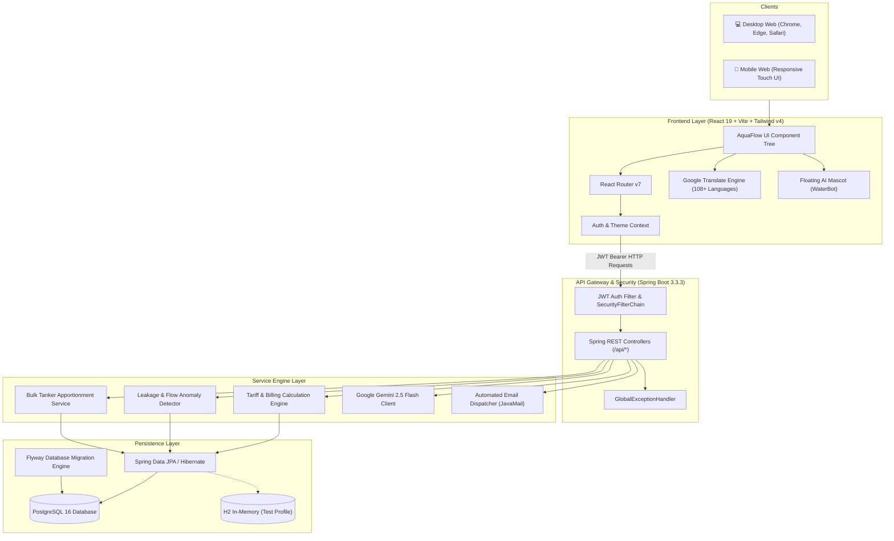

# 🌊 AquaFlow — Smart Water Usage Monitoring & Automated Tiered Billing Platform

[](https://spring.io/projects/spring-boot)
[](https://openjdk.org/projects/jdk/21/)
[](https://react.dev/)
[](https://vitejs.dev/)
[](https://tailwindcss.com/)
[](https://www.postgresql.org/)
[](https://ai.google.dev/)
[](https://jwt.io/)

> **AquaFlow (WaterGuard)** is an enterprise-grade IoT telemetry and billing automation platform designed for modern apartment complexes, gated societies, and residential townships. It solves urban water equity disputes through digital sub-metering, tiered fairness tariffs, automated bulk tanker apportionment, AI leakage detection radar, and real-time multilingual accessibility.

---

## 📌 Table of Contents

- [Problem Statement & Urban Context](#-problem-statement--urban-context)
- [System Architecture](#-system-architecture)
- [Core Platform Capabilities](#-core-platform-capabilities)
  - [1. Smart IoT Meter Telemetry & Leakage Radar](#1-smart-iot-meter-telemetry--leakage-radar)
  - [2. Automated Tiered Billing & Fair Apportionment Engine](#2-automated-tiered-billing--fair-apportionment-engine)
  - [3. Society Administration & Flat Authorization Workflow](#3-society-administration--flat-authorization-workflow)
  - [4. Resident Self-Service Portal](#4-resident-self-service-portal)
  - [5. AI WaterBot Assistant (Gemini Flash)](#5-ai-waterbot-assistant-gemini-flash)
  - [6. Universal Multilingual Localization (108+ Languages)](#6-universal-multilingual-localization-108-languages)
  - [7. Universal Light & Dark Theme System](#7-universal-light--dark-theme-system)
  - [8. Mobile-First Responsive Experience](#8-mobile-first-responsive-experience)
- [Technology Stack](#-technology-stack)
- [Database Schema & Data Model](#-database-schema--data-model)
- [REST API Reference](#-rest-api-reference)
- [Project Directory Structure](#-project-directory-structure)
- [Installation & Local Setup](#-installation--local-setup)
  - [Prerequisites](#prerequisites)
  - [1. Database Initialization](#1-database-initialization)
  - [2. Backend Setup (Spring Boot)](#2-backend-setup-spring-boot)
  - [3. Frontend Setup (React + Vite)](#3-frontend-setup-react--vite)
- [Default Demo Credentials](#-default-demo-credentials)
- [Security & Production Hardening](#-security--production-hardening)
- [Contributors & License](#-contributors--license)

---

## 🏙️ Problem Statement & Urban Context

In multi-story residential communities, water consumption is traditionally billed as a **flat maintenance fee** or divided equally regardless of actual usage. This legacy model leads to:
1. **Inequitable Resource Distribution**: Conscious low-consumption households unfairly subsidize heavy water consumers.
2. **Hidden Leaks & Wastage**: Underground pipeline bursts or leaking internal fixtures remain undetected for weeks until exorbitant bills arrive.
3. **Tanker Procurement Conflicts**: High-cost emergency private tanker deliveries are purchased without transparent resident-level attribution.
4. **Administrative Overheads**: Society management committees spend hundreds of hours manually compiling Excel sheets, meter readings, and invoice notices.

**AquaFlow** transforms apartment water management into an automated, transparent, and eco-friendly ecosystem by coupling **smart sub-metering telemetry**, **dynamic tiered tariffs**, and **AI leakage radar**.

---

## 🏛️ System Architecture



---

## 🚀 Core Platform Capabilities

### 1. Smart IoT Meter Telemetry & Leakage Radar
- **Telemetry Ingestion**: Continuous daily/hourly water meter log recording (manual verification or automated IoT sensor payloads).
- **Leakage Radar**: Algorithmically detects abnormal flow rates, continuous night-time flow anomalies, zero-drop fixtures, and pressure variances.
- **Acoustic & Flow Scoring**: Assigns severity scores (`LOW`, `MEDIUM`, `HIGH`, `CRITICAL`) with proactive visual badges and SMS/email alerts.

### 2. Automated Tiered Billing & Fair Apportionment Engine
- **Configurable Tariff Slabs**: Slabs can be customized per society (e.g. 0–8,000L base quota @ ₹15/kL; 8,001–15,000L @ ₹28/kL; >15,000L penal quota @ ₹45/kL).
- **Fixed & Sewage Charges**: Society-wide fixed base operational charges and percentage-based wastewater maintenance surcharges.
- **Bulk Tanker Apportionment**: When municipal supply falls short, tanker procurement costs are transparently distributed using weighted consumption metrics.
- **One-Click Invoice Cycles**: Bulk invoice generation with due dates, payment status tracking, and printable breakdowns.

### 3. Society Administration & Flat Authorization Workflow
- **Single-Admin Community Isolation**: Each apartment community has exactly one verified society administrator account, preventing unauthorized takeovers.
- **Flat Onboarding Gateway**: Residents apply to join their respective community and flat number; access remains locked until the designated administrator approves the request.
- **Households Directory**: Full directory with flat numbers, wings, typology (`1BHK` to `Penthouse`), occupancy counts, meter serials, and contact information.

### 4. Resident Self-Service Portal
- **Live Consumption Analytics**: Interactive charts showing usage trends vs. society averages.
- **Invoice Archive**: View current outstanding bills, historical invoice details, slab-wise breakdowns, and payment statuses.
- **Ticketing & Concerns**: Resident complaint portal to report pipe leakages, meter discrepancies, or water pressure issues directly to society maintenance.
- **Announcements**: Broadcast board for maintenance schedules, tanker arrival logs, and water rationing notifications.

### 5. AI WaterBot Assistant (Gemini Flash)
- Powered by **Google Gemini 2.5 Flash**, the embedded floating assistant answers resident and administrator queries:
  - *"How can our household reduce water usage from Tier 2 to Tier 1?"*
  - *"Explain how the tanker purchase surcharge was calculated on my bill."*
  - *"What are the signs of a concealed toilet flush leakage?"*

### 6. Universal Multilingual Localization (108+ Languages)
- **108+ Global and Indian Regional Languages**: Full coverage for Hindi, Kannada, Tamil, Telugu, Marathi, Gujarati, Bengali, Malayalam, Punjabi, Urdu, Assamese, Odia, Spanish, French, German, Arabic, Chinese, Japanese, and more.
- **Searchable Dropdown**: Real-time filter input by native script, English name, or ISO language code.
- **Clean UI & Zero Layout Shifts**: Automatic suppression of Google Translate top banners and tooltip popups.
- **Persistent Preference**: Remembers the selected language across refreshes, while strictly defaulting first-time users to English.

### 7. Universal Light & Dark Theme System
- Tailwind CSS v4 custom variant integration (`dark:` theme classes across all views).
- Instant toggle in header with animated Sun/Moon icons and persistent `localStorage` synchronization.
- High-contrast color palettes ensuring readability for night shifts and low-light mobile usage.

### 8. Mobile-First Responsive Experience
- **Dedicated Mobile Landing Screen**: Clean, high-impact branding on mobile screens (`< lg`) displaying platform benefits and clear action cards.
- **Universal 3-Mode Segmented Control**: 1-tap switching between `Sign In`, `Resident Flat`, and `Society Admin` without tedious vertical scrolling.
- **Fixed Left Sidebar**: Permanent desktop docking with scrollable viewport so sign-out and primary actions remain always accessible.

---

## 🛠️ Technology Stack

| Layer | Technologies |
|---|---|
| **Frontend Framework** | React 19.2 (Vite 8.2), JSX, ES Modules |
| **Styling & Design** | Tailwind CSS v4.3, Lucide React Icons, Clsx, Tailwind Merge |
| **Data Visualization** | Recharts 3.10 |
| **Backend Framework** | Spring Boot 3.3.3 (Java 21 LTS) |
| **Security & Auth** | Spring Security 6, JJWT (io.jsonwebtoken 0.12.6), BCrypt |
| **ORM & Data Access** | Spring Data JPA, Hibernate, HikariCP |
| **Database Migrations**| Flyway Migration Engine (PostgreSQL / MySQL support) |
| **Databases** | PostgreSQL 16 (Production) & H2 Database (In-Memory Dev Profile) |
| **AI Integration** | Google Gemini API (`gemini-2.5-flash`) |
| **Localization** | Google Translate Element API with Custom DOM & Cookie Automation |
| **Notifications** | Spring Boot Starter Mail (SMTP) |

---

## 🗄️ Database Schema & Data Model

The PostgreSQL database enforces relational integrity across 10 core tables:

```
apartments (1) ──────────< households (N) ──────────< meter_readings (N)
     │                          │
     │                          ├──────────────────< invoices (N)
     │                          │
     ├──────< users (N)         └──────────────────< alerts (N)
     │
     ├──────< tariff_plans (1) ──────< tariff_tiers (N)
     │
     ├──────< bulk_water_purchases (N)
     │
     └──────< billing_cycles (N) ─────< invoices (N)
```

| Table Name | Description | Key Attributes |
|---|---|---|
| `apartments` | Residential societies / communities | `id`, `name`, `code`, `city`, `total_flats`, `common_area_sqft` |
| `households` | Specific apartment flats/units | `apartment_id`, `flat_no`, `block_wing`, `bhk_type`, `meter_serial_no` |
| `users` | Admin and resident accounts | `email`, `password_hash`, `role` (`ADMIN`/`RESIDENT`), `household_id` |
| `tariff_plans` | Active tariff rules per society | `base_fixed_charge`, `sewage_maintenance_pct`, `bulk_purchase_markup_pct` |
| `tariff_tiers` | Tiered volumetric pricing slabs | `tariff_plan_id`, `tier_level`, `min_liters`, `max_liters`, `rate_per_1000_liters`|
| `meter_readings`| Digital sub-meter readings | `household_id`, `reading_date`, `current_reading_liters`, `anomaly_score` |
| `bulk_water_purchases` | Water tanker purchase records | `apartment_id`, `purchase_date`, `liters_purchased`, `total_cost` |
| `billing_cycles`| Billing schedule batches | `cycle_name`, `start_date`, `end_date`, `status` (`OPEN`/`CLOSED`) |
| `invoices` | Household generated bills | `household_id`, `billing_cycle_id`, `total_amount`, `status` (`PAID`/`DUE`) |
| `alerts` | Leakage & payment notices | `household_id`, `severity`, `title`, `message`, `is_resolved` |

---

## 🔌 REST API Reference

All backend endpoints are scoped under the `/api` context path:

### 🔑 Authentication (`/api/auth`)
| Method | Endpoint | Description | Auth Required |
|---|---|---|---|
| `POST` | `/api/auth/register` | Register new residential society + Administrator | Public |
| `POST` | `/api/auth/register-resident` | Submit flat registration request to society admin | Public |
| `POST` | `/api/auth/login` | Authenticate user and receive JWT Bearer token | Public |
| `POST` | `/api/auth/google` | One-Click Gmail authentication | Public |
| `GET` | `/api/auth/me` | Fetch active user principal and role | User / Admin |

### 🏢 Societies & Households (`/api/apartments`)
| Method | Endpoint | Description | Auth Required |
|---|---|---|---|
| `GET` | `/api/apartments` | List all verified registered societies | Public |
| `GET` | `/api/apartments/{id}/households` | List all flats and active residents | Admin |
| `POST` | `/api/apartments/{id}/households` | Create/onboard a new residential flat | Admin |
| `PATCH` | `/api/apartments/residents/{id}/approve` | Approve resident flat join request | Admin |

### 📊 Meter Telemetry (`/api/readings`)
| Method | Endpoint | Description | Auth Required |
|---|---|---|---|
| `GET` | `/api/readings/household/{id}` | Historical readings for a specific flat | User / Admin |
| `POST` | `/api/readings` | Ingest new meter reading log | Admin / IoT |
| `GET` | `/api/readings/anomalies` | Retrieve leakage & flow anomaly alerts | Admin |

### 💰 Tariffs & Billing (`/api/tariffs`, `/api/billing`)
| Method | Endpoint | Description | Auth Required |
|---|---|---|---|
| `GET` | `/api/tariffs/active` | Get active tiered pricing plan | User / Admin |
| `PUT` | `/api/tariffs/update` | Update tiered slabs and fixed charges | Admin |
| `POST` | `/api/billing/generate-cycle` | Execute billing cycle calculation engine | Admin |
| `GET` | `/api/billing/invoices/my` | Retrieve logged-in resident's invoices | Resident |
| `POST` | `/api/billing/invoices/{id}/pay` | Record invoice settlement | User / Admin |

### 🤖 AI Assistant (`/api/chat`)
| Method | Endpoint | Description | Auth Required |
|---|---|---|---|
| `POST` | `/api/chat/query` | Submit water advisory prompt to Gemini Flash | User / Admin |

---

## 📂 Project Directory Structure

```
major-project/
├── backend/                               # Spring Boot 3.3.3 Java 21 Application
│   ├── pom.xml                            # Maven dependencies & build configuration
│   └── src/
│       ├── main/
│       │   ├── java/com/waterguard/
│       │   │   ├── config/                # Security, JWT, CORS, Exception Handlers
│       │   │   ├── controller/            # REST API Controllers
│       │   │   ├── dto/                   # Data Transfer Objects
│       │   │   ├── model/                 # JPA Entities (Apartment, Household, etc.)
│       │   │   ├── repository/            # Spring Data Repositories
│       │   │   ├── service/               # Business Logic, Billing Engine, Gemini AI
│       │   │   └── WaterGuardApplication.java
│       │   └── resources/
│       │       ├── application.yml        # PostgreSQL, Hikari, Mail, JWT configs
│       │       └── db/migration/          # Flyway SQL migration scripts (V1, V2)
│       └── test/                          # Unit and Integration test suites
│
├── frontend/                              # React 19 + Vite 8 Single Page App
│   ├── package.json                       # Scripts and Node dependencies
│   ├── vite.config.js                     # Vite build & Tailwind plugin config
│   ├── index.html                         # Google Translate engine loader & root mount
│   └── src/
│       ├── components/
│       │   ├── admin/                     # Admin Dashboard, Radar, Tariffs, Directory
│       │   ├── resident/                  # Resident Dashboard, Bills, Usage, Tickets
│       │   ├── auth/                      # Mobile Landing View & Login/Register Forms
│       │   ├── layout/                    # TopHeader, Fixed Sidebar, Mascot Bot
│       │   └── common/                    # Toast notifications, modals, cards
│       ├── context/
│       │   └── AuthContext.jsx            # State management for auth, role, theme, lang
│       ├── services/
│       │   └── api.js                     # Axios/Fetch client with JWT interceptors
│       ├── utils/
│       │   └── languagesList.js           # 108+ languages catalog & translation helper
│       ├── App.jsx                        # React Router layout & public/protected routes
│       ├── main.jsx                       # React DOM root entrypoint
│       └── index.css                      # Tailwind v4 configuration & theme styles
│
├── database/                              # Standalone Database Scripts
│   ├── schema.sql                         # Pure PostgreSQL DDL schema
│   ├── seed_data.sql                      # Demo communities, residents & readings
│   └── flyway/                            # Versioned migration files
│
└── README.md                              # Complete Project Documentation
```

---

## 💻 Installation & Local Setup

### Prerequisites
Make sure your development machine has the following installed:
- **Java Development Kit (JDK) 21** or later (`java -version`)
- **Apache Maven 3.9+** (`mvn -version`)
- **Node.js 18+ & npm 9+** (`node -v`, `npm -v`)
- **PostgreSQL 15+** server running locally (`psql -U postgres`)

---

### 1. Database Initialization

1. Connect to PostgreSQL and create the database:
   ```sql
   CREATE DATABASE jalsetu;
   ```
2. Verify credentials in `backend/src/main/resources/application.yml`:
   ```yaml
   spring:
     datasource:
       url: jdbc:postgresql://localhost:5432/jalsetu
       username: postgres
       password: your_postgres_password
   ```
   *(Note: Flyway will automatically run all migrations on startup).*

---

### 2. Backend Setup (Spring Boot)

1. Open a terminal in the `backend/` directory:
   ```bash
   cd backend
   ```
2. Clean and build the application:
   ```bash
   mvn clean install -DskipTests
   ```
3. Run the Spring Boot application:
   ```bash
   mvn spring-boot:run
   ```
4. The backend API will start on:
   ```
   http://localhost:8080/api
   ```

---

### 3. Frontend Setup (React + Vite)

1. Open a terminal in the `frontend/` directory:
   ```bash
   cd frontend
   ```
2. Install npm dependencies:
   ```bash
   npm install
   ```
3. Start the Vite development server:
   ```bash
   npm run dev
   ```
4. Open your browser and navigate to:
   ```
   http://localhost:5173/
   ```

---

## 🔑 Default Demo Credentials

The platform includes pre-seeded demo accounts for quick evaluation:

| Role | Email Address | Password | Permissions |
|---|---|---|---|
| **Society Administrator** | `admin@waterguard.io` | `Admin@123` | Full community administration, tariff config, meter reading entry, bill cycles, and resident approvals. |
| **Apartment Resident** | `resident3@gmail.com` | `Resident@123` | View personal flat consumption telemetry, historical bills, support concerns, and notifications. |

> 💡 *Both demo accounts can also be logged into with a single click using the **"Quick Demo Accounts"** button on the login screen.*

---

## 🛡️ Security & Production Hardening

- **Stateless JWT Tokens**: Tokens are signed using HMAC-SHA256 (`jjwt 0.12.6`) and verified on every protected request.
- **BCrypt Password Hashing**: Sensitive user passwords are encrypted with industry-standard salt rounds before database persistence.
- **Role-Based Access Control (RBAC)**: Enforced via Spring Security's `PreAuthorize` checks (`ROLE_ADMIN` vs `ROLE_RESIDENT`).
- **Single-Admin Integrity Constraint**: Society registration mandates exactly one verified administrator per residential apartment complex code.
- **Cross-Site Scripting (XSS) & CORS**: Strict CORS policy configured in `SecurityConfig.java` to restrict unauthorized domain origins.

---

## 📄 Contributors & License

- **Developer**: Vijay Rodge & Team
- **Infosys Springboard Major Project**: Water Usage Monitoring & Billing Administration Platform
- **License**: Released under the [MIT License](LICENSE) — free for educational, residential society, and commercial adaptation.

---

<div align="center">
  <sub>Built with ❤️ for sustainable water conservation and intelligent smart communities.</sub>
</div>

